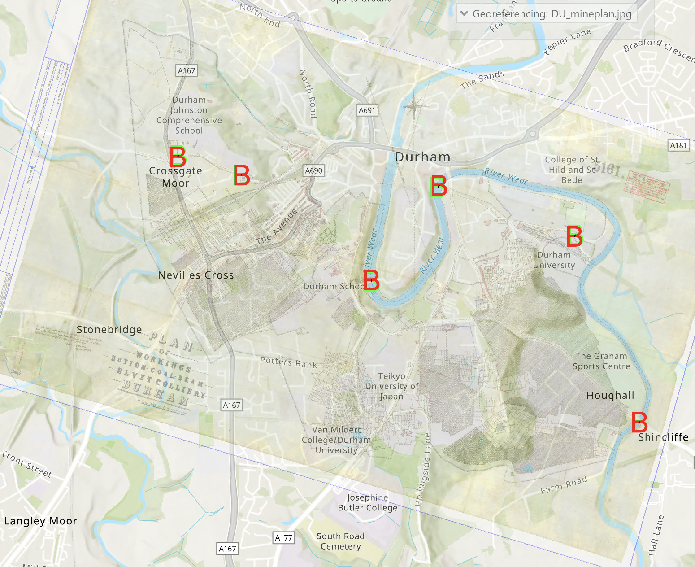
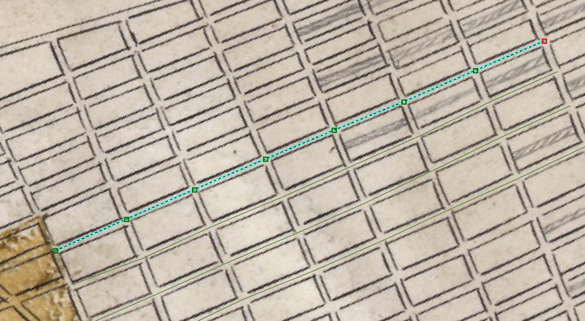
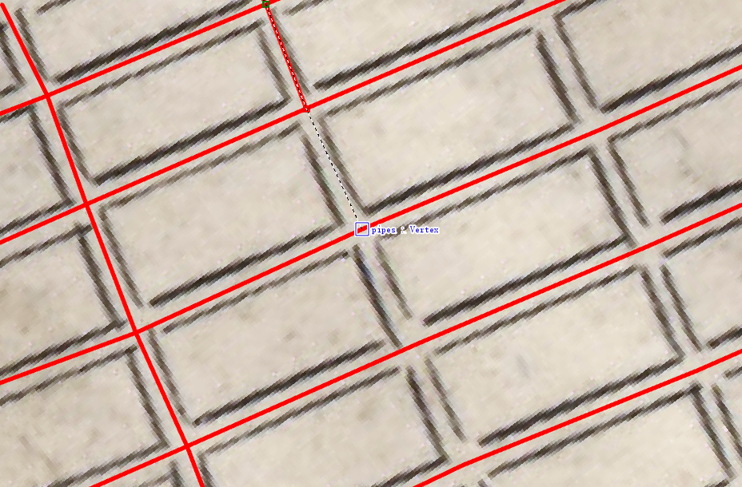
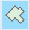
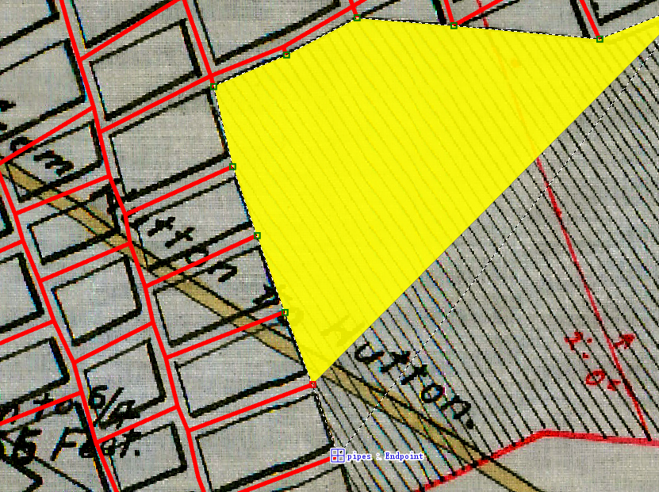

# Digitising mine plans with ArcGIS Pro

## Creating a new mine plan project in ArcGIS Pro

. The digitisation of mine plans is done using the ArcGIS Pro software tool. So open the tool as described above.

1.  First, log in to ArcGIS. CLick sign-in in top-right corner. You will be asked to provide the institutional website. For members of Durham University, this is: <https://DurhamUni.maps.arcgis.com>.

2.  ArcGIS Pro can be unstable sometimes, so make sure you regularly save your progress.

3.  If you are continuing an existing project, type the name of the project in the ’Recent Project’ finder too, or click the ’Open another project’ button. You can then skip one or more of the following steps.

4.  If you start a new project, click on the ’Map’ icon under ’New Project’. It will prompt you for a project name and a location to store in on the local storage drive.

5.  Note that if ArcGIS Pro is run via Durham University’s Appsanywhere, then the project files will be stored on the ’J-drive’. More information on how to access this file storage space and transfer files from/to it, see the Sharepoint folder [here](https://durhamuniversity.sharepoint.com/sites/MyDigitalDurham/SitePages/ServicePage.aspx?Service=%22Personal%20Storage%20%28J%20Drive%29%22). The ArcGIS project will probably be located on the J-drive, in the folder `<username>/My Documents/ArcGIS/Projects/<project>`

6.  Place an image of the mine plan you want to digitize in the `<project>` folder of the newly created ArcGIS project.

7.  Add the mine plan to the ArcGIS project, by right-clicking the ’Map’ item in the Contents pane (on the left), and choose the ’Add Data’ option. Choose the mine plan file. Do not click on ’Band_1’, ’Band_2’, or ’Band_3’, but simply click ’OK’. If asked about ’Calculating statistics for ...’, answer ’No’. This will now add your mine plan, but you won’t see the mine plan appearing in the map yet.

8.  In the Contents pane (on the left), right-click on the mine plan, and choose ’Zoom to Layer’. You should now see the mine plan in the map.

9.  The mine plan does not have a correct location yet (it probably appears at $0^o$E $0^o$N, i.e. somewhere in the middle of the Atlantic Ocean), and needs to be ’georeferenced’, which means that the mine plan needs to be connected to the map in the right geographical location:

    1.  In the Contents pane, click on the mine plan filename.

    2.  In the top menu, click the ’Imagery’ tab, then $\Rightarrow$ Georeference $\Rightarrow$ Add Control Points

    3.  Choose a point on the mine plan that you can accurately connect to a point on the map, e.g. an old building, bridge, church.

    4.  Click on the point on the mine plan, and then (without clicking!) zoom out and in to the related point on the map and click again. This might take a little getting used to: by zooming out from a certain mouse position and then moving in at a different mouse position, you can navigate across the map. Before connecting the first set of points (a point on the mine plan to a point on the map), so you’ll need to zoom out and back in a lot.

    5.  after making the first connection point, the map will be in approximately the right position, and therefore the mine plan will cover the map. So you’ll need to change the transparency to see both the mine plan and the map: click on the ’Raster Layer’ tab, after which you’ll see a ’Transparency’ option that you can change.

    6.  make the second connection point, so that the scale and orientation of the mine plan fit more or less with the map.

    7.  Now add a few more connection points to account for any skewness of the mine plan. Figure <a href="#fig:georeferencing" data-reference-type="ref" data-reference="fig:georeferencing">1</a> shows an example of a georeferenced mine plan.

        <figure id="fig:georeferencing">
        
        <figcaption>Example of a georeferenced mine plan. The connection points used for georeferencing are illustrated as ’B’ on the map.</figcaption>
        </figure>

    8.  Once you are satisfied with the georeferencing, click ’Save’ and then ’Close Georeference’.

## Digitising roadways and galleries

Now we can start with the digitisation. We’ll start with adding the mine galleries and roadways (’pipes’) in the room-and-pillar parts of the mine workings, and then we’ll add any ’goaf’ area for the long-wall mining parts of the mine workings later on. Digitising the galleries and roadways is done as follows.

Note: Please strictly follow the following steps to digitise the mine workings, carefully check and draw the intersection points either between galleries or between galleries and goaf.

1.  In the Catalog pane, expand ’Databases’ to see the pipes in its contents.

2.  Right-click on the `.gdb` file inside the ’Databases’, and choose New $\Rightarrow$ Feature Class. Choose a name (e.g. ’pipes’). In ’Feature Class Type’, choose ’Line’. Un-tick the ’Z-values’ option, since we will assume that seams are horizontal, and will add a uniform depth for the seam later. Click ’Next’ multiple times to check all other options, but default values are probably fine. Click ’Finish’ to initialize the dataset.

3.  Click the output data set that was just created (’pipes’?) in the Contents pane.

4.  Click the Edit tab (if you run ArcGIS Pro via Appsanywhere, choose the Edit tab in ArcGIS Pro, not the one for the Parallels Client).

5.  Click ’Create’ to start creating the pipes. A ’Create Features’ pane will now appear as a second tab next to the ’Catalog’ pane on the rhs.

6.  Click on the ’pipes’ item in the ’Create Features’ pane. A blue box with different options will appear. Make sure the ’line’ option  is highlighted.

7.  Expand the ’Snapping’ item in the top ribbon to make sure the snapping tool is switched on. This will make sure that lines will be snapped together if the end point of a new line is close enough to a previous line.

8.  Now create a few lines. It can help save time if you draw the lines in a certain order(for example, horizontal first and then vertical). So click at starting point, and click once at each crossroad to make a vertex and double click at end point. It will look like figure <a href="#fig:long_lines" data-reference-type="ref" data-reference="fig:long_lines">2</a>. When you finish drawing horizontal lines, you start to draw vertical lines as Figure <a href="#fig:double_lines" data-reference-type="ref" data-reference="fig:double_lines">3</a>. When you approach each crossroad point, some thing like "pipes: vertex" will appear, you can click on that vertix to guarantee two pipes intersect on that vertex.

    <figure id="fig:long_lines">
    
    <figcaption> Draw lines in a single direction</figcaption>
    </figure>

    <figure id="fig:double_lines">
    
    <figcaption>Draw lines in the other direction to intersect with the previous lines</figcaption>
    </figure>

9.  to see previously created lines more clearly, right-click ’pipes’ in the Contents pane, and choose ’Symbology’, which creates a ’Symbology’ tab in the rhs pane. Double click ’line’ on the right side of the ’Symbol’ in that Symbology pane, and then on ’Properties’ next to ’Gallery’. Now change the thickness of the line to 3pt or 4pt, and choose a bright, clearly visible colour. Click on ’Create’ again to continue creating more lines.

10. if you need to modify a line (e.g. because it doesn’t snap into a neighbouring line’, click on ’Modify’, then click-and-drag the end point of the line you want to move to its new position.

11. If you need to delete a previously created line, then in the ’Edit’ tab, drop-down the ’Select’ option, choose ’Line’, then double-click the line you want to delete, and right-click and choose ’Delete’ to remove

12. Once you are finished (or temporarily suspend adding more pipes, press ’Save’. To delete a ’goaf’ area, follow the same procedure, but choose ’Polygon’ instead of ’Line’ in the ’Select’ drop-down menu.

## Digitising goaf areas

If the mine workings contain any goaf area, then these need to be digitised as well. If no goaf areas are present, or if you want to add those later, you can jump straight to the next section. Digitising the goaf areas is done with a similar procedure as for the galleries and roadways.

1.  In the rhs pane, open the ’Catalog’ tab again.

2.  Click on triangle in front of ’Databases’ to look at its contents.

3.  Right-click on the `.gdb` file inside the ’Databases’, and choose New $\Rightarrow$ Feature Class. Choose a name (e.g. ’goaf’). Un-tick the ’Z-values’ option again. Click ’Next’ multiple times to check all other options, but default values are probably fine. Click ’Finish’ to initialize the dataset.

4.  Click the output data set that was just created (’goaf’?) in the Contents pane.

5.  Click the Edit tab, and then ’Create’ to start creating the goaf area.

6.  In the ’Create Features’ pane click on the ’goaf’ item. A blue box with different options will appear. Make sure the ’polygon’ option  is highlighted.

7.  Make sure the snapping tool is again switched on.

8.  Next, with a series of single-clicks, outline the corners of a goaf area and also click when meeting the endpoint of pipes to ensure connections between goaf and galleries(Figure <a href="#fig:goaf_lines" data-reference-type="ref" data-reference="fig:goaf_lines">4</a>). Double-click on the penultimate point (not on the point you started with, since ArcGIS will automatically close the polygon after the final point is added.

    <figure id="fig:goaf_lines">
    
    <figcaption>Draw goaf outlines to intersect with the endpoints of pipes</figcaption>
    </figure>

9.  Repeat the last task for any other goaf areas you want to add.

10. Once finished, press Save again.

## Preparing data for the GEMSToolbox

Next a Python script is loaded in ArcGIS to perform the digitization. The pipe nodes will be numbered.

1.  Download the latest version of the GEMSToolbox.

2.  Copy the file `src/external_functions/GEMSToolbox.py` to the ArcGIS project folder.

3.  Open the Python window in ArcGIS from the ’View’ tab, by clicking ’Python Window’, which will create an additional Python window at the bottom of the ArcGIS tool.

4.  Open the GEMSToolbox.py file using a text editor (e.g. textedit), and copy the lines from "`# COPY FROM THIS LINE ...`" to "`# ... TO THIS LINE ...`" into the ArcGIS Python window. Press the "Enter" key once or twice to run the pasted commands. This will load in the GEMSToolbox set of Python commands into ArcGIS. Mac users, note that if you run ArcGIS via Appsanywhere, then you need to use the MS Windows shortkey for ’Paste’ (i.e. Control-V, not Command-V).

5.  Make sure the Map view is enabled in ArcGIS otherwise running the commands below will result in some errors.

6.  Next run the following Python command in the ArcGIS Python window:

    > `GEMSToolbox.generate_shapefile(<gallery>, <depth>, <goaf>, `
    >
    > \<snap_porous_zone\>)

    in which:

    - `<gallery>` is the name of the Feature Class that contains the galleries/roadways inside double quotes (e.g.: `"pipes"`),

    - `<depth>` the depth of the coal seam in meters below the surface (e.g. `-65`),

    - `<goaf>` (optional argument) the name of the Feature Class containing the snapped goaf areas created in the previous step, inside double quotes (e.g. `"goaf"` or `"goaf_snapped"` if you used the optional step 5.) If you have no goaf areas, then leave out the last argument.

    - `<snap_porous_zones>` If you are confident that your goaf areas have been correctly connected to the galleries and then set to False. Therefore carefully check your connections before you take this step.

    - Note that this symbol `<>` for each item should be removed after you replace them using specific values.

    One example is like: `GEMSToolbox.generate_shapefile("pipes", -65, "goaf", "False")`

7.  This Python script might take a while to run, particularly if your digitised mine system is large. Once finished, it produces a number of files with the same base name, as listed in the Python window (typically `complete_set_feature_1`. The first copy of the file is saved into your ArcGIS project database, the second is located into your project directory to be easily accessed. Copy all the `complete_set_feature_1` files located into the project directory over to the `maps` folder of the GEMSToolbox (you may want to create a subfolder inside `maps` to keep the folder tidy). This completes the digitisation process in ArcGIS Pro.

8.  If you are confident all your connections between pipe lines and goaf polygons are perfectly done as the above steps without missing any connections between two nodes, you can run your model using GEMSToolbox smoothly. However, you might meet problems sometimes, especially when you run the model with complex goaf zones. If such, you need to adjust the parameters Qth and flow_error_threshold. Their default values are set to 1E-7 and 1E-15, respectively. In most cases, you can gradually increase Qth in Excel sheet to a a bit larger value, but better not greater than 1E-4. If the problem still can’t be solved, please contact yuxiao.wang2@durham.ac.uk.
