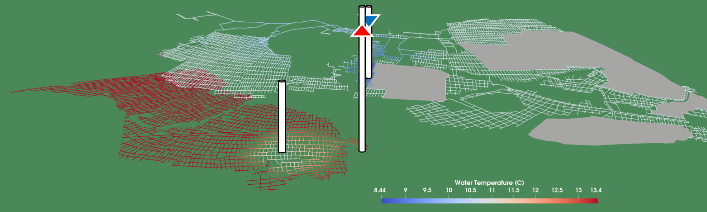

# Welcome to the GEMSToolbox Manual

GEMSToolbox is a modelling framework for assessing the feasibility and performance of mine water geothermal (MWG) systems. It is designed to support rapid, site-specific evaluation of heat extraction from flooded and abandoned mine workings.

This manual provides guidance on installing, configuring, and using GEMSToolbox, as well as background information on its modelling approach and assumptions.

## What is GEMSToolbox?

Mine water geothermal systems utilise the thermal energy stored in underground mine networks. These systems are particularly relevant in former coal mining regions, where extensive subsurface infrastructure can act as a distributed heat reservoir.

GEMSToolbox enables users to simulate:

* Fluid flow through interconnected mine workings
* Heat exchange between mine water and surrounding rock
* Thermal evolution over time, including long-term sustainability of heat extraction

The toolbox is specifically designed for early-stage feasibility studies, where rapid turnaround and the ability to explore multiple scenarios are critical.

## Key Features

* Efficient modelling approach: Captures key physical processes while remaining computationally lightweight
* Flexible geometry handling: Supports complex mine networks derived from digitised mine plans
* Transient simulations: Evaluates system performance over operational timescales
* Scenario testing and uncertainty analysis: Enables rapid comparison of design options and parameter sensitivities
* Thermal interaction assessment: Quantifies interference between nearby workings or systems

## Who is this for?

GEMSToolbox is intended for:

* Researchers working on geothermal energy and subsurface flow
* Engineers and consultants evaluating MWG systems
* Stakeholders involved in energy transition projects in former mining regions

## How to use this manual

This documentation is structured to support both new and experienced users:

* Getting Started – Installation and first steps
* Concepts and Methods – Underlying modelling approach
* Workflow Guides – Typical use cases and examples
* Reference – Input formats, parameters, and functions

If you are new to GEMSToolbox, start with Getting Started.
If you are familiar with the tool, use the navigation to access specific topics.

## Citation

If you use GEMSToolbox in your work, please cite:
> Mouli-Castillo, J., van Hunen, J., MacKenzie, M., Sear, T., & Adams, C. (2024)
> GEMSToolbox: A novel modelling tool for rapid screening of mines for geothermal heat extraction.
> Applied Energy, 360, 122786
> [https://doi.org/10.1016/j.apenergy.2024.122786](https://doi.org/10.1016/j.apenergy.2024.122786)

## Acknowledgements

GEMSToolbox was developed as part of the [GEMS](https://gems.ac.uk) project, which aims to advance the use of mine water geothermal energy through integrated modelling, monitoring, and field studies.
