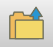
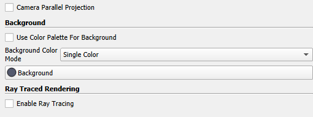

# View outputs

The outputs of each Scenario input file are saved in the `outputs/[scenario_filename]` folder. The outputs consist of:

- A `.vtk` file for each of the runs in that scenario named: `[scenario_filename]_[tag]_[runindex]`

- A `.csv` file which records the relative temperature of each outflow node in each run. The relative temperature $T_r$ is given by $T_r = T_{out}/\Delta T$, where $\Delta T = |T_{r,max} - T_{w,min}|$, i.e. the difference between maximum rock temperature and minimum water temperature.

The `.vtk` file contains all the output information as set in the input file, and these can be viewed using Paraview. Here are a few basic steps to create a plot to view the results.

1.  Open Paraview

2.  Click on the folder icon  in the top-left corner, and navigate to the `.vtk` file, press ’OK’.

3.  click ’Apply’. You should now be able to view the temperature solution.

4.  To view a different parameter (e.g. water velocity or hydraulic head), choose a different parameter from the drop-down menu on the second row that now states "T(C)".

5.  To re-scale the colour bar to the full range of values, use the  icon.

6.  To change the line width of the galleries, click to highlight the v̇tk file in the "Pipeline Browser" panel at the top-left, and then, in the "Properties" panel at the bottom-left scroll down to "Line Width".

7.  To get information about a specific node in the network, click the image icon, and click ’OK’. Now zoom in onto the area of interest, and hover the mouse over a node to see the available information.

8.  There are a lot of options to customise the plot further. One handy option in Paraview is that you can save the customised view as a ’state’, and then load it back in later on, for the same or for a different data set. To do that, choose ’File’ $\Rightarrow$ ’Save State...’, which saves the state as a `.pvsm` file. Next time you use Paraview, you can use the same state by, instead of using the  icon to load a `.vtk` file, use ’File’ $\Rightarrow$ ’Load State...’, and choose the previously saved `.pvsm` file. In the ’Load State Data File’ option, choose ’Choose File Names’, and choose the `.vtk` file to display, then press ’OK’. The `outputs` folder in the GEMSToolbox code already contains a `.pvsm` file to get started.

9.  Change the background colour, find the ’Background’ section in ’Properties’, untick ’Use Color Palette For Background’, click background button to choose suitable colour (Figure <a href="#fig:background" data-reference-type="ref" data-reference="fig:background">5</a>).

    <figure id="fig:background">
    
    <figcaption>Change the background colour</figcaption>
    </figure>

10. Change title/text font colour. When the background colour is changed, the legend title/text font colour might also need to be changed. Click ’edit colour map’  to open colour map editor. Then click ’Edit colour legend properties’ button  to open ’Edit Colour Legend Properties’, choose the suitable colour for legend title and text.
